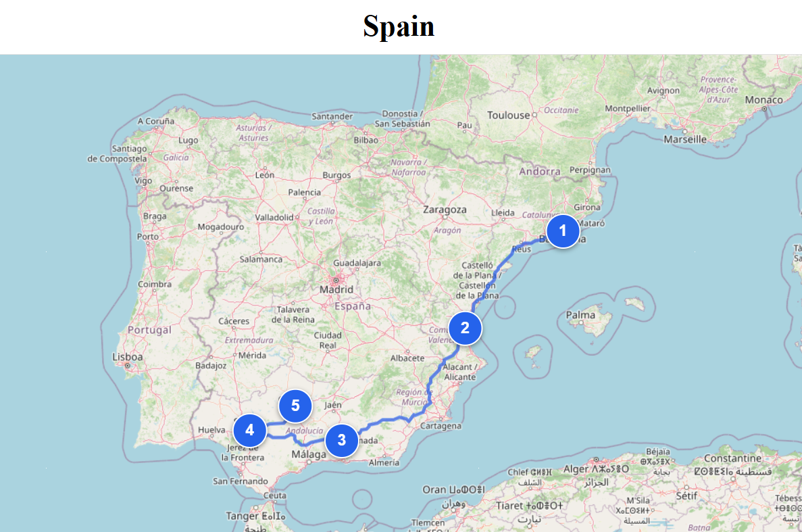

# TripFlow
**TripFlow** is a tool developed as a personal project for travelers around the world to plan their trips. It offers a clean and simple UI with helpful AI tools to plan your travels.

If you would like to use the site on your phone, scan this QR code. Using a computer is recommended though. 

## Updates
These updates were made after the YouTube video was created (see below). So the effects of the updates are not in the video.

### 4/23/2026
* Added QR code functionality for **Attractions**, **Hotels**, **Car Rentals**, and **Find Flights**.

* Changed colors of some of the buttons

* Added a trip map that takes the starting location of each day of the trip and converts it into a pin on a map. Each pin has a clicakble link to its schedule. Routes between each pin are highlighted. For accurate results, choose your locations using the map picker or through AI autofill.

* Improved location diversity and route feasibility in AI trip generation.

* Improved the alert and confirm popups to appear more stylish and non-intrusive.

* Implemented fixes to mitigate URL traversal in map pages.

* Added some notices to decrease confusion.

* Below is an example of a trip map for a five-day Spain trip:

## Directions and Video Demo
To use **TripFlow** please enter https://tripflow-app-d3e2c.web.app/login or use the QR code above. Then register your account with a valid email. Firebase will then send you a verification email. 

Once you log in, you can create a trip and set up the dates. You can add/edit an activity. Each activity contains a weather button which takes coordinates from the map. The weather feature only works if you select the location from the map or create a trip using AI. Details button reveals more info about the point of interest in Google Maps. 

You can also find flights, hotels, tours, and car rentals by clicking on the respective buttons. The buttons lead to a popup that contain the link and a QR code. AI analysis and autofill buttons exist at the top of the schedule page and offer a convenient feature that no other travel planners provide.

If you would like to view a map of your trip, in the page for the specific trip, go to the bottom where it says **View Trip Map** and click on the button. You can click on the pins to go to the schedule for that day.

**The AI and Weather APIs rely on Render, and if Render has been inactive for some time, then it will take up to a few minutes for Render to "wake up". This causes the first AI/Weather API call after user inactivity to take up to a few minutes sometimes.**

If the site is not live at the time that you see this or if you have any questions, then please view this video demonstration here: https://www.youtube.com/watch?v=5UguLbktGI0

## Features
* **Add/Edit Trips, Dates, and Travel Activities**: Users can detail an activity's name, location (map selection with search), time, and expected/actual cost.
* **Trip Summary**: Compares difference between expected and actual costs and provides it in a thought-provoking format.
* **Weather**: Worried about the weather? You do not have to Google it. Users can simply click the "Weather" button for a comprehensive forecast. For accurate results, you must choose the location in the map picker or through AI autofill.
* **AI Analysis**: Users can analyze the trip's feasibility, budget, hotels, and more!
* **AI Autofill**: If users run out of ideas during planning, they can ask AI to create activities which includes locations, times, and expected costs. Users can AI-generate an entire trip or just a single day. Users can edit results to their satisfaction. **During autofill, do not click anywhere or let the device sleep, as that can mess up the autofill process. Stay in the tab.**
* **Redirection**: Allows users to find more information on a point of interest, hotels, car rentals, flights, and tours through **Google Maps**, **Booking.com**, **Google Flights**, and **Get Your Guide**.
* **User Interface**: The site uses a very simple design and allows easy navigation. Users do not have to learn too much to use it. It also uses large font and simple colors for travelers who have poor vision issues.
* **Cybersecurity**: 
  * The registration component uses email validation and strong password rules. 
  * Angular is used to prevent XSS (cross site scripting). Buffer overflow also is not an issue here. 
  * Passwords are stored securely and never in plaintext. 
  * Once you logout, the back button does not take you back to your account. Modifiying the URL without signing in will fail as well.
  * The site uses HTTPS to ensure your interactions with the site are encrypted and secure.

* See **Updates** section above to view more features.

## Tools Used
* **Angular**: Uses **Typscript** to create a clean frontend experience. Provides anti-XSS capabilities.
* **Flask**: Uses Python and the **REST API** to communicate with external APIs and client.
* **Firebase**: Provides authentication, storage database, and hosting for the frontend.
* **Render**: Hosts the Flask backend with automatic deployment. Uses **Gunicorn** to increase timeout.
* **WeatherAPI.com**: Efficiently provides a comprehensive forecast for any part of the world.
* **OpenRouter**: Provides numerous models to choose from for the site's AI features.
* **OpenStreetMap**: Allows users to view a map.
* **Leaflet**: Displays the map and allows user interaction.
* **Nominatim API**: Reverse geocoding to translate coordinates into a name (map feature).
* **Open-Meteo Geocoding API**: Used to translate names into coordinates for car rental URL redirection.
* **api.qrserver.com**: Used to generate QR codes.
* **TinyURL**: Shortens long car rental URLs. Makes QR codes more efficient.
* **Open Source Routing Machine**: Generates real routes between multiple locations on the map.
